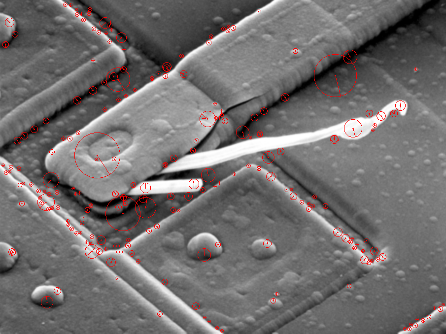
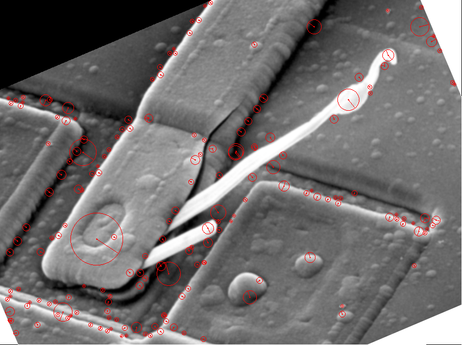
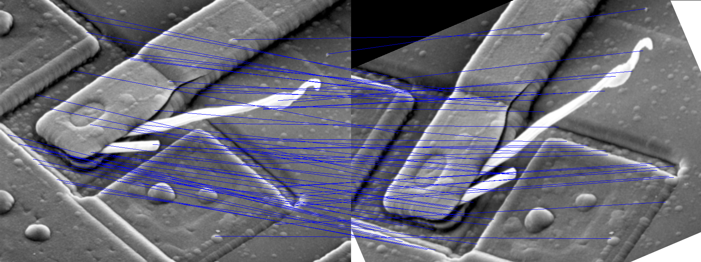
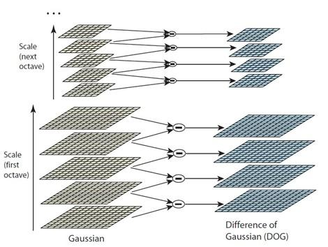
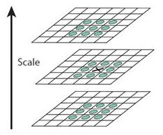
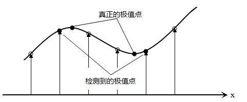
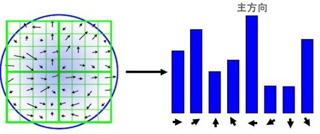
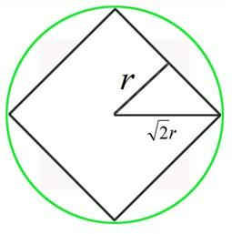
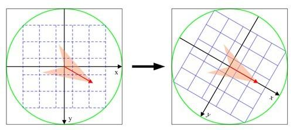

# SIFT 特征提取与匹配
## 0. 简介
* Repo中的代码仅基于C++的基本库实现了SIFT特征提取与匹配, 无需调用如OpenCV的库函数. 本代码很大程度地**基于ezSIFT代码**, 在其基础上进行了一定程度的简化优化, 同时根据本人理解调整了代码结构并添加了注释. 
* 本ReadMe在介绍完代码文件说明与编译运行方法后, 从实现细节的角度介绍了SIFT算法流程, 该部分受益于$原论文^{[1]}$和$Blog解读文章^{[3]}$
> 由于代码并非完全原创, License请阅读[ezSIFT](https://github.com/robertwgh/ezSIFT)的相关内容.

## 1. SIFT
SIFT(尺度不变特征转换,Scale-invariant Feature Transform)是一种计算机视觉常用的特征提取算法(David Lowe1999年所发表, 2004年完善总结),包括基于DoG的特征检测和利用SIFT描述子的特征描述. SIFT描述子的性能评价最佳(Mikolajczyk & Schmid, 2005), 是迄今使用最为广泛的一种特征.

SIFT特征是图像的一种局部特征, 具有以下特点:
* 不变性: 对图像的旋转和尺度缩放具有不变性，对视角变化和亮度变化具有很强的适应性, 同时由于是局部特征, 因而对遮挡和噪声也保持一定程度的稳定性.
* 特异性(Distinctiveness): 辨别力强, 特征之间相互区分的能力强, 有利于特征匹配.
* 多量性: 即使少数的几个物体也可以产生大量的SIFT特征向量.
* 扩展性: 可以很方便的与其他形式的特征向量进行联合.

## 2. 代码文件说明与运行
### 2.1 代码文件说明
* [image_match.cpp](./image_match.cpp): SIFT关键点检测与匹配代码文件
* [src](./src)文件夹包含了SIFT算法代码文件和相关基础代码及库文件.
  * [sift.cpp](./src/sift.cpp)和[sift.h](./src/sift.h)分别是SIFT算法的代码文件和库文件
  * [image_utility.cpp](./src/image_utility.cpp)包含了匹配和可视化相关代码
  * [image_utility.h](./src/image_utility.h)是可视化和图像基础库函数
  * [image.h](./src/image.h)是图像基本处理辅助函数库文件
  * [common.h](./src/common.h)包含了数学数值定义,基础运算和矩阵运算的库文件
* [img2pgm](./img2pgm)是本代码的辅助文件夹, 用于将图片转为P5格式的pgm文件.

### 2.2 运行
* 运行Demo
  
  `./image_match img1 img2`
  
  其中img1和img2分别是两个特征提取与匹配的图像文件名. 运行后SIFT特征点检测结果会可视化并以SIFT_KP_1.ppm和SIFT_KP_2.ppm文件名保存, 匹配结果也会可视化并以SIFT_match.ppm文件名保存.

* 将图片转为P5的pgm格式*[Option]* 
  
  将待转换图片文件置于img2pgm文件夹, 并运行

  `python img2pgm.py`
  
  可将文件夹内指定格式的图片文件转为P5的pgm文件, 并保存在指定位置. 包含参数-ImageType和-SavePath

* 关于编译
  在[build](./build)文件夹内运行

     `cmake ..`

     `make`

  SIFT特征提取与匹配的编译文件image_match保存在bin文件夹内. 

### 2.3 效果Demo
* SIFT特征提取可视化结果
  

    
    
  

* SIFT特征匹配可视化结果
  

    
  

## 3. SIFT 特征提取流程与实现细节
### 3.1 多尺度空间极值点检测
> 搜索所有尺度上的图像位置, 通过高斯微分函数识别潜在的对尺度和旋转不变的兴趣点.
1. 使用高斯模糊实现多尺度空间的获取. 根据高斯函数的可分离性, 通过两次一维高斯模糊实现二维高斯模糊, 提高计算效率. 计算复杂度由原始的$O(m*n*M*N)$简化为$O(n*M*N)+O(m*M*N)$.
2. 尺度空间使用高斯金字塔表示. 尺度规范化的LoG(Laplacion of Gaussian)算子具有真正的尺度不变性，文章使用高斯差分金字塔近似LoG算子.
  * 图像的金字塔模型是指，将原始图像不断降阶采样，得到一系列大小不一的图像，由大到小从下到上构成的塔状模型. 原图像为金子塔的第一层，每次降采样所得到的新图像为金字塔的一层(每层一张图像)，每个金字塔共n层. 金字塔的层数根据图像的原始大小和塔顶图像的大小共同决定，$n = log_2{min(M,N)}-t$, $t \in [0, log_2{ming(M,N)}$, 其中M,N为原图像的大小,t为塔顶图像的最小维数的对数值.
  * 为了让尺度体现其连续性，高斯金字塔在简单降采样的基础上加上了高斯滤波. 将图像金字塔每层的一张图像使用不同参数进行高斯模糊，使得每层含有多张高斯模糊图像(Interval)，将每层多张图像合称为一组(Octave)，金字塔组数和金字塔层数相等. 降采样时，高斯金字塔一组图像的初始图像是由前一组图像的倒数第3张图像隔点采样得到的. 
   
  

    
  

3. 高斯差分金字塔. 2002年Mikolajczyk在详细的实验比较中发现尺度归一化的高斯拉普拉斯函数的极大值和极小值同其它的特征提取函数比较，能够产生最稳定的图像特征. 而Lindeberg早在1994年就发现高斯差分函数(Difference of Gaussian,DoG)与尺度归一化的高斯拉普拉斯函数非常近似. 在实际计算时，使用高斯金字塔每组中相邻上下两层图像相减，得到高斯差分图像，进行极值检测.
4. 空间极值点检测. 关键点是由DOG空间的局部极值点组成的，关键点的初步探查是通过同一组内各DoG相邻两层图像之间比较完成的. 为了寻找DoG函数的极值点，每一个像素点要和它所有的相邻点比较. 中间的检测点和它同尺度的8个相邻点和上下相邻尺度对应的9×2个点共26个点比较，以确保在尺度空间和二维图像空间都检测到极值点. 为了在每组中检测S个尺度的极值点，则DOG金字塔每组需S+2层图像，而DOG金字塔由高斯金字塔相邻两层相减得到，则高斯金字塔每组需S+3层图像，实际计算时S在3到5之间.
  

    
  

5. 涉及到的参数
   
   * 关键点的尺度空间坐标$\sigma(o,s) = \sigma_0 * 2^{o+\frac{s}{S}}$, 其中$\sigma_0$是基准层尺度, $o$为组索引, $s$为组内层索引.
   * 在构建高斯金字塔时, 组内每层的尺度坐标$\sigma(s)=\sqrt{(k^s \sigma_0)^2 - (k^{s-1}\sigma_0)^2}$, 其中k为组内总层数的倒数, $\sigma_0$为初始尺度, lowe取1.6. 不同组相同层的组内尺度坐标相同, 组内下一层图像是由前一层图像按照$\sigma(s)$进行高斯模糊所得.

### 3.2 关键点定位
> 目前检测到的是离散空间的极值点，而离散采样中搜索到的极值点不一定是真实空间的极值点. 本步通过对尺度空间DoG函数进行曲线拟合,计算其极值点,从而实现关键点的精确定位. 同时去除低对比度的关键点和不稳定的边缘响应点以增强匹配稳定性、提高抗噪声能力. 

1. 关键点的精确定位. 利用已知的离散空间点插值得到的连续空间极值点的方法叫做子像素插值(Sub-pixel Interpolation). 利用DoG函数在尺度空间的Taylor展开式, $D(X) = D+\frac{\partial D^T}{\partial X}X+ \frac{1}{2}X^T\frac{\partial^2 D}{\partial X^2}X$, 其中, $X=(x,y,\sigma)^T$. 求导并取零, 可以得到极值点的偏移量为$\hat{X} = - \frac{\partial^2 D^{-1}}{\partial X^2} \frac{\partial D}{\partial X}$. 对应极值点, $D(\hat{X}) = D + \frac{1}{2}\frac{\partial D^T}{\partial X}\hat{X}$. 当偏移量在任一维度上大于0.5时,意味着插值中心已经偏移到它的邻近点上. 此时需改变当前关键点的位置, 同时在新的位置上反复插值直至收敛. 对于超出设定的迭代次数或图像边界的范围的点, 应该删除. Lowe进行了5次迭代.
  

    
  

2. 去除低对比度点. $|D(\hat{x})|$过小的点容易受噪声干扰, 因而是不稳定的. 因此, 将$|D(\hat{x})|$小于某个阈值的极值点删除. Lowe使用阈值0.03, Rob Hess使用$\frac{0.04}{S}$.
3. 消除边缘点. DoG算子会产生较强的边缘响应, 需要剔除不稳定的边缘点. 利用Hessian矩阵H判断关键点是否位于边缘. 矩阵H的最大特征值和最小特征值的比值越大, 说明在某个方向上梯度大而另一个方向上的梯度小, 也即边缘. 因此剔除比值大于某一阈值的点. 实现时, 通过计算H的迹和行列式避免直接求特征值, 减少计算量. 对于代表x和y方向的梯度的特征值$\alpha和\beta$有
   $$
   Tr(H) = \alpha + \beta\\
   Det(H) = \alpha \beta
   $$

  因此, 只需判断$\frac{Tr(H)^2}{Det(H)} < \frac{(r+1)^2}{r}$是否成立, 成立时保留, 反之剔除. Lowe取$r=10$.

### 3.3 关键点方向确定
> 为了使特征描述子具有旋转不变性，需要利用图像的局部特征为给每一个关键点分配一个基准方向. 使用图像梯度的方法求取局部结构的稳定方向. 

1. 关键点梯度计算. 对于检测出的关键点，采集其所在高斯金字塔图像$3\sigma$邻域窗口内像素的梯度和方向分布特征. 梯度的模值和方向为
$$
m(x,y) = \sqrt{(L(x+1,y)-L(x-1,y))^2+(L(x,y+1)-L(x,y-1))^2}\\
\theta(x,y) = actan(\frac{L(x,y+1)-L(x,y-1)}{L(x+1,y)-L(x-1,y)})
$$

其中, L为关键点所在的尺度空间值, Lowe将模值$m(x,y)$按照$\sigma=1.5\sigma_{octave}$的高斯分布加成, 邻域窗口半径为$3*1.5\sigma_{octave}$

2. 使用直方图统计邻域内像素的梯度和方向. 梯度直方图将360°均匀划分为36个bins, 以直方图的峰值方向代表关键点的主方向. 考虑到匹配的鲁棒性, 保留大于主方向峰值80%的方向为关键点的辅方向. 实现时, 同一位置可存在多个尺度相同但方向不同的关键点. 为求得更精确的方向角度值, 对离散的梯度方向直方图进行插值拟合处理.
  

    
  

### 3.4 描述子构造
> SIFT描述子是关键点邻域高斯图像梯度统计结果的一种表示。通过对关键点周围图像区域分块，计算块内梯度直方图，生成具有独特性的向量，这个向量是该区域图像信息的一种抽象，具有唯一性.

1. 确定计算描述子所需的图像区域. 将关键点附近的邻域划分为d*d个子区域, 每个子区域作为一个种子点, 每个种子点有8个方向. Lowe将d取值为4. 每个子区域的尺度与确定关键点方向时相同, 取值为$3 \sigma_{octave}$. 考虑到实际计算时需要采用双线性插值, 因而窗口边长为$3 \sigma_{octave} * (d+1)$. 为方便后续将坐标轴旋转到关键点方向, 实际计算的图像区域半径$r = \frac{3 \sigma_{octave} * \sqrt{2} * (d+1)}{2}$
  

    
  

2. 将坐标轴旋转为关键点方向, 以确保旋转不变性. 旋转后邻域内采样点的新坐标可通过原坐标和方向角度计算得到.
  

    
  

3. 将子区域内的梯度值分配到8个方向, 并计算其权值. 根据旋转后的采样点坐标, 可以将邻域内的采样点分配到对应的子区域内, 计算影响子区域的采样点的梯度及方向, 并分配到8个方向上. Lowe建议子区域的像素的梯度大小按照$\sigma=0.5d$的高斯加权计算.
4. 插值计算每个种子点8个方向的梯度. 
5. 统计关键点的特征向量($4*4*8=128$个梯度信息). 为去除光照变化的影响, 对形成的特征向量进行归一化处理.
6. 设置特征描述子门限. 由于非线性光照及相机饱和度变化造成某些方向的梯度值过大, 因此设置门限阈值已截断较大的梯度值. 在上一步归一化后, 一般取阈值为0.2. 为提高特征的鉴别性, 再一次进行归一化处理.
7. 按特征点的尺度对特征描述向量进行排序.

### 参考内容

[1] David G. Lowe, Distinctive Image Features from Scale-Invariant Keypoints, International Journal of Computer Vision, Vol. 60, Page 91-110, 2004.

[2] https://github.com/robertwgh/ezSIFT

[3] https://blog.csdn.net/zddblog/article/details/7521424

